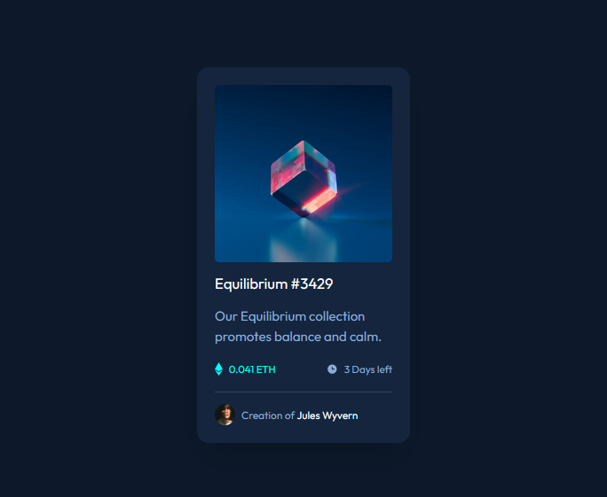

# NFT-preview-card-design
# NFT Preview Card Component

A simple responsive NFT preview card built with HTML and Tailwind CSS. This project showcases an NFT with hover effects and detailed information such as the price, creator, and time left.

## Project Overview

This project demonstrates a preview card for an NFT, which includes:
- Hover effect to show a "view" icon on top of the image.
- Displays NFT price in Ethereum (ETH).
- Shows the remaining time and creator's name.
- Uses Tailwind CSS for styling and responsiveness.

## Features

- Responsive design.
- Hover animation effect for images.
- Tailwind CSS for styling.
- Clean and simple layout.

## Screenshot

## Tech Stack

- **HTML**: Basic structure of the NFT preview card.
- **Tailwind CSS**: For styling and responsive design.
- **Font**: Google Fonts "Outfit" for typography.

